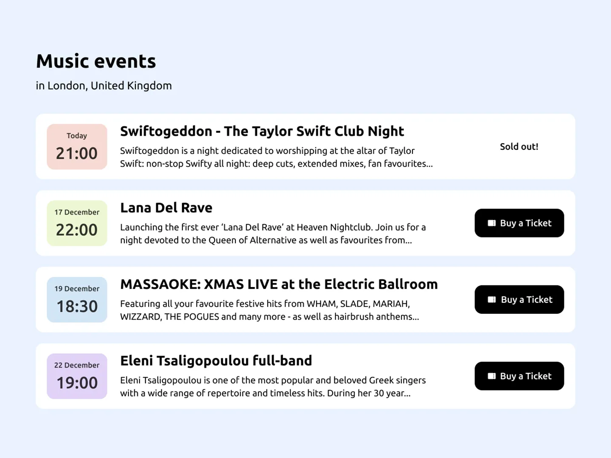

# Challenge Name: Music Events

You can work on this challenge directly in [BigDevSoon Code Editor](https://app.bigdevsoon.me/challenges/music-events/browser).

## Introduction

This is an opportunity to apply your skills in HTML, CSS, and JavaScript to create a solution that reflects the design. We encourage creativity and uniqueness while adhering to the design principles outlined in the challenge.

## User Story

As an event enthusiast, I want to easily view upcoming music events and purchase tickets through a clear and efficient interface, ensuring I can plan my attendance without any confusion.

## Acceptance Criteria

- The page includes a heading "Music events" with a subtitle indicating the location.
- Events are listed chronologically with clear distinctions between different days.
- Each event displays the time, title, and a brief description.
- The availability status (e.g., "Sold out!" or "Buy a Ticket") is clearly indicated next to each event.
- 'Buy a Ticket' buttons are prominent and functional, allowing direct purchase or reservation.
  The layout is responsive, providing a seamless experience across various devices and screen sizes.

## Get Started

Begin your development with the `index.html` provided in the challenge's folder. You can work on this challenge directly in the [BigDevSoon Code Editor](https://app.bigdevsoon.me/challenges/music-events/browser) and use the assets available to you and refer to the design screenshot for visual guidelines. Push your boundaries and remember, perfection comes through practice and iteration.

## Best Practices and Tips

- Design Accuracy: Your solution should closely match the layout and style of the provided screenshot.
- Interactivity: Enhance user interaction through JavaScript to elevate the experience beyond a static display.
- Functionality: Ensure that all elements are functional, with attention to detail in the implementation.
- Quality Assurance: Submit a well-coded, clean, and organized solution that adheres to modern web standards.
- Code Quality: Write clean, readable, and well-commented code to maintain best practices in development.
- Responsive Design: Ensure your challenge solution is responsive and functions well on various devices.
- Performance Optimization: Optimize image sizes and script efficiency to improve the loading times and responsiveness of your code.
