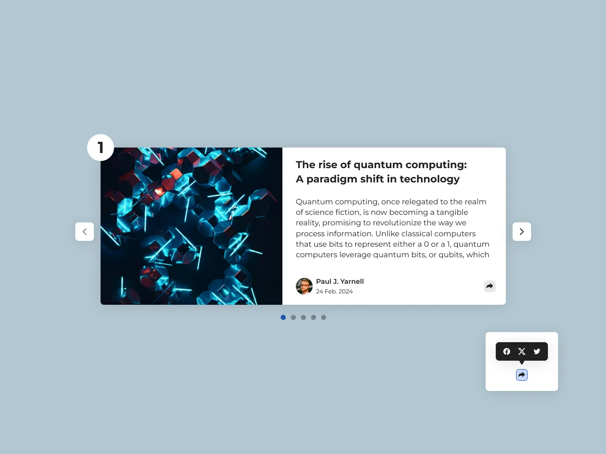

# Challenge Name: Article Slider

You can work on this challenge directly in [BigDevSoon Code Editor](https://app.bigdevsoon.me/challenges/article-slider/browser).

## Introduction

This is an opportunity to apply your skills in HTML, CSS, and JavaScript to create a solution that reflects the design. We encourage creativity and uniqueness while adhering to the design principles outlined in the challenge.

## User Story

As a user interested in technology, I want a dynamic and informative slider interface that presents the latest articles or news in a visually appealing way, allowing me to easily navigate through different pieces of content.

## Acceptance Criteria

- The interface features a main article view with a high-resolution image, title, and a brief summary or introduction of the article.
- Navigation arrows are clearly visible on both sides of the slider, allowing users to move to the next or previous article.
- An indicator, such as a numbered pagination or dots, shows the current position within the series of articles.
- The user can interact with social media sharing buttons directly from the slider to share content on platforms like Facebook, Twitter, and via email.
- The author's name and the publication date are prominently displayed, adding credibility and context to the information presented.
- The design ensures responsiveness, providing a seamless experience across various devices and screen sizes, adapting layout and controls appropriately.

## Get Started

Begin your development with the `index.html` provided in the challenge's folder. You can work on this challenge directly in the [BigDevSoon Code Editor](https://app.bigdevsoon.me/challenges/article-slider/browser) and use the assets available to you and refer to the design screenshot for visual guidelines. Push your boundaries and remember, perfection comes through practice and iteration.

## Best Practices and Tips

- Design Accuracy: Your solution should closely match the layout and style of the provided screenshot.
- Interactivity: Enhance user interaction through JavaScript to elevate the experience beyond a static display.
- Functionality: Ensure that all elements are functional, with attention to detail in the implementation.
- Quality Assurance: Submit a well-coded, clean, and organized solution that adheres to modern web standards.
- Code Quality: Write clean, readable, and well-commented code to maintain best practices in development.
- Responsive Design: Ensure your challenge solution is responsive and functions well on various devices.
- Performance Optimization: Optimize image sizes and script efficiency to improve the loading times and responsiveness of your code.
