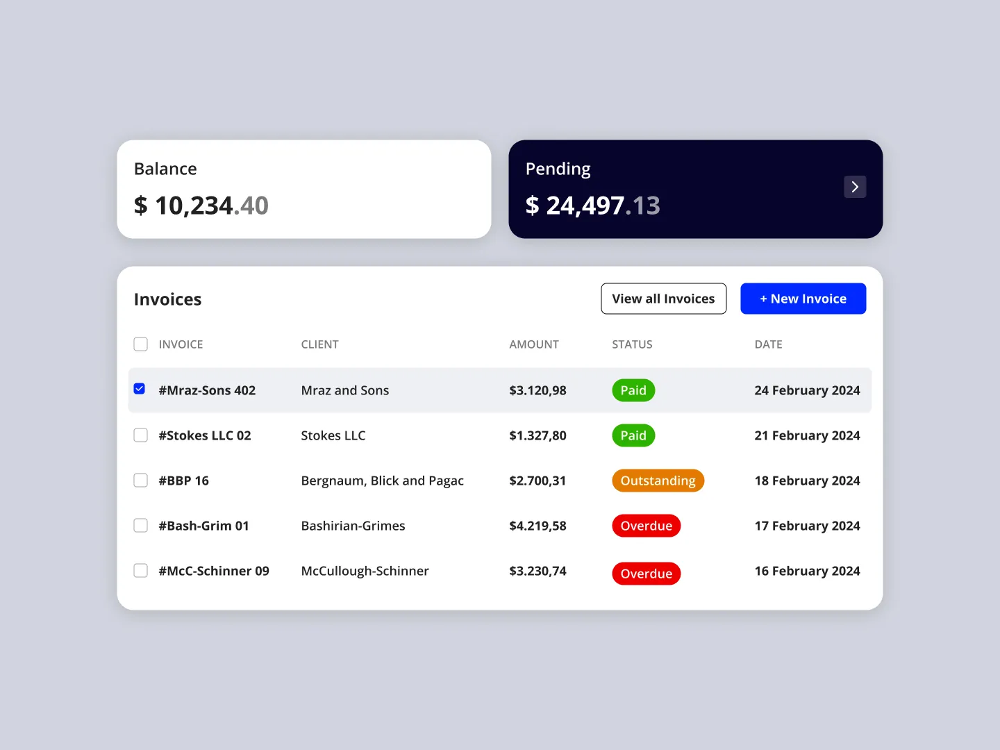

# Challenge Name: Invoices

You can work on this challenge directly in [BigDevSoon Code Editor](https://app.bigdevsoon.me/challenges/invoices/browser).

## Introduction

This is an opportunity to apply your skills in HTML, CSS, and JavaScript to create a solution that reflects the design. We encourage creativity and uniqueness while adhering to the design principles outlined in the challenge.

## User Story

As a business owner or freelancer, I want an intuitive and efficient invoice management dashboard that allows me to quickly view, track, and manage my invoices, ensuring that I can maintain financial clarity and control over my transactions.

## Acceptance Criteria

- The dashboard must display a summary of the user’s financials, including current balance and pending amounts, prominently at the top of the interface.
- An "Invoices" section should list all invoices with essential details such as invoice number, client name, amount due, status (e.g., Paid, Outstanding, Overdue), and the date issued.
- Each invoice entry should be actionable, allowing users to click on them to view more detailed information or to perform actions like editing, sending reminders, or marking as paid.
- Status indicators for invoices must be color-coded (e.g., green for paid, yellow for outstanding, red for overdue) to allow for quick visual sorting and recognition.
- There should be options to filter or sort invoices based on status, date, amount, or client name to streamline the management process.
- The interface should include quick-access buttons such as "View all invoices" and "+ New Invoice" to enhance user navigation and productivity.
- The design must be responsive, ensuring that the dashboard is accessible and functional on various devices, maintaining usability and visual appeal across different screen sizes.

## Get Started

Begin your development with the `index.html` provided in the challenge's folder. You can work on this challenge directly in the [BigDevSoon Code Editor](https://app.bigdevsoon.me/challenges/invoices/browser) and use the assets available to you and refer to the design screenshot for visual guidelines. Push your boundaries and remember, perfection comes through practice and iteration.

## Best Practices and Tips

- Design Accuracy: Your solution should closely match the layout and style of the provided screenshot.
- Interactivity: Enhance user interaction through JavaScript to elevate the experience beyond a static display.
- Functionality: Ensure that all elements are functional, with attention to detail in the implementation.
- Quality Assurance: Submit a well-coded, clean, and organized solution that adheres to modern web standards.
- Code Quality: Write clean, readable, and well-commented code to maintain best practices in development.
- Responsive Design: Ensure your challenge solution is responsive and functions well on various devices.
- Performance Optimization: Optimize image sizes and script efficiency to improve the loading times and responsiveness of your code.
