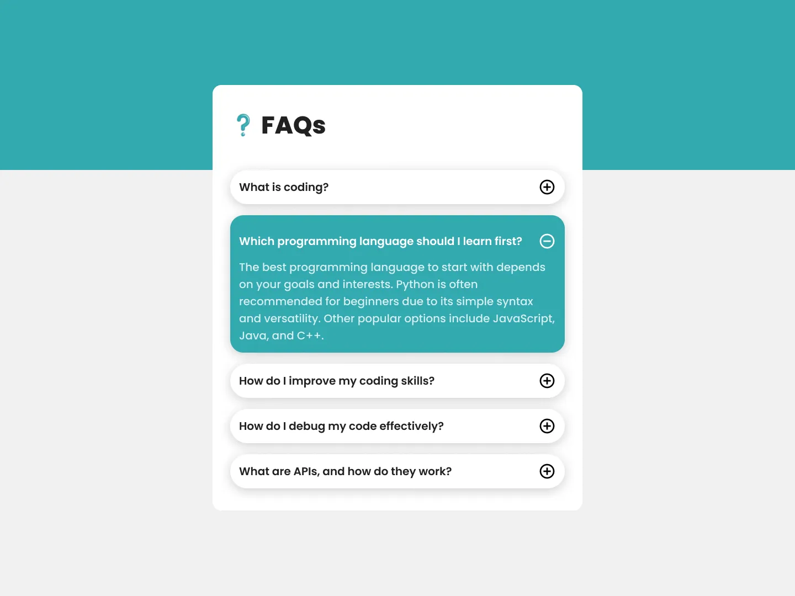

# Challenge Name: FAQ

You can work on this challenge directly in [BigDevSoon Code Editor](https://app.bigdevsoon.me/challenges/faq/browser).

## Introduction

This is an opportunity to apply your skills in HTML, CSS, and JavaScript to create a solution that reflects the design. We encourage creativity and uniqueness while adhering to the design principles outlined in the challenge.

## User Story

As a user, I want to easily access and navigate a frequently asked questions (FAQ) section, so I can quickly find answers to common questions about coding and programming without needing to search extensively or contact support.

## Acceptance Criteria

- Display a list of common questions with a concise and informative summary visible before expansion, making it easy for users to identify relevant topics.
- Include an intuitive expand/collapse feature for each question, allowing users to view detailed answers with a simple click or tap.
- Ensure that the questions are categorized or ordered logically to guide users through from basic to more complex topics seamlessly.
- Design the interface to be visually clean and minimalistic, reducing visual clutter and focusing the user’s attention on the content.
- Provide interactive elements, like icons or indicators, that visually signify whether a question is expanded or collapsed.
- Optimize the FAQ interface for responsiveness, ensuring it functions smoothly across different devices and screen sizes, maintaining legibility and accessibility.

## Get Started

Begin your development with the `index.html` provided in the challenge's folder. You can work on this challenge directly in the [BigDevSoon Code Editor](https://app.bigdevsoon.me/challenges/faq/browser) and use the assets available to you and refer to the design screenshot for visual guidelines. Push your boundaries and remember, perfection comes through practice and iteration.

## Best Practices and Tips

- Design Accuracy: Your solution should closely match the layout and style of the provided screenshot.
- Interactivity: Enhance user interaction through JavaScript to elevate the experience beyond a static display.
- Functionality: Ensure that all elements are functional, with attention to detail in the implementation.
- Quality Assurance: Submit a well-coded, clean, and organized solution that adheres to modern web standards.
- Code Quality: Write clean, readable, and well-commented code to maintain best practices in development.
- Responsive Design: Ensure your challenge solution is responsive and functions well on various devices.
- Performance Optimization: Optimize image sizes and script efficiency to improve the loading times and responsiveness of your code.
