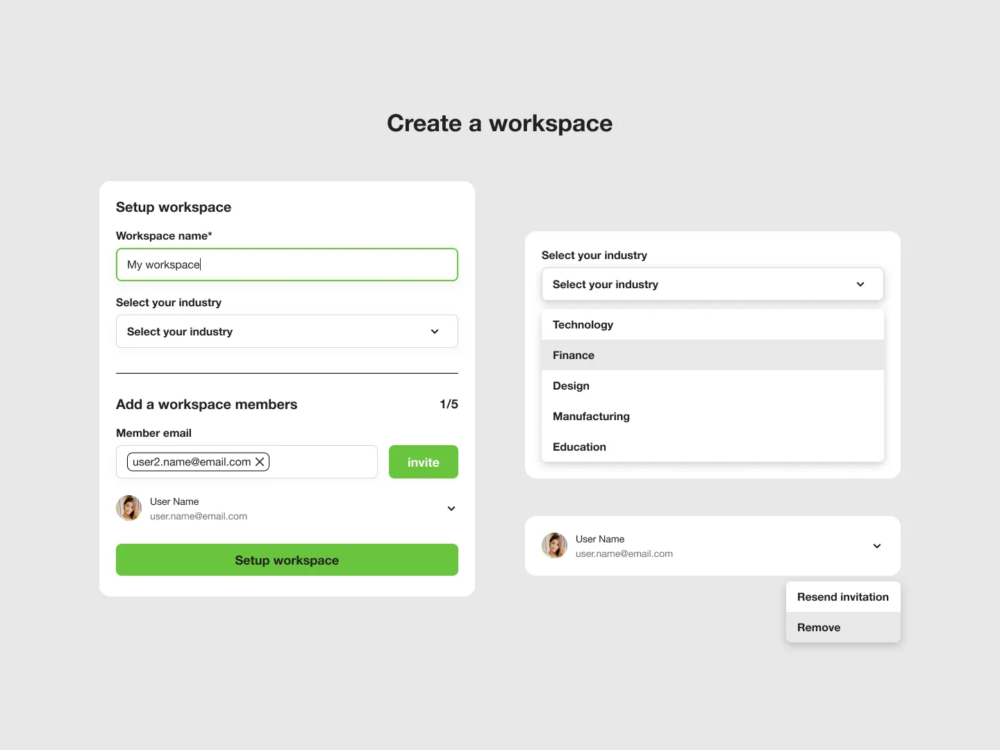

# Challenge Name: Create Workspace

You can work on this challenge directly in [BigDevSoon Code Editor](https://app.bigdevsoon.me/challenges/create-workspace/browser).

## Introduction

This is an opportunity to apply your skills in HTML, CSS, and JavaScript to create a solution that reflects the design. We encourage creativity and uniqueness while adhering to the design principles outlined in the challenge.

## User Story

As a user, I want to create a workspace that is tailored to my industry and allows for easy member management, so I can collaborate efficiently with my team.

## Acceptance Criteria

- Provide a form to input the workspace name with clear validation for required fields.
- Include a dropdown menu for selecting an industry, offering predefined options such as Technology, Finance, Design, Manufacturing, and Education.
- Allow the user to add members to the workspace by entering their email addresses, with the option to invite up to five members initially.
- Enable the functionality to resend invitations or remove added members, enhancing user control over member management.
- Design the form to be intuitive with straightforward navigation, ensuring a seamless setup process.
- Ensure the workspace creation interface is responsive and works well on both desktop and mobile devices to accommodate various user environments.

## Get Started

Begin your development with the `index.html` provided in the challenge's folder. You can work on this challenge directly in the [BigDevSoon Code Editor](https://app.bigdevsoon.me/challenges/create-workspace/browser) and use the assets available to you and refer to the design screenshot for visual guidelines. Push your boundaries and remember, perfection comes through practice and iteration.

## Best Practices and Tips

- Design Accuracy: Your solution should closely match the layout and style of the provided screenshot.
- Interactivity: Enhance user interaction through JavaScript to elevate the experience beyond a static display.
- Functionality: Ensure that all elements are functional, with attention to detail in the implementation.
- Quality Assurance: Submit a well-coded, clean, and organized solution that adheres to modern web standards.
- Code Quality: Write clean, readable, and well-commented code to maintain best practices in development.
- Responsive Design: Ensure your challenge solution is responsive and functions well on various devices.
- Performance Optimization: Optimize image sizes and script efficiency to improve the loading times and responsiveness of your code.
