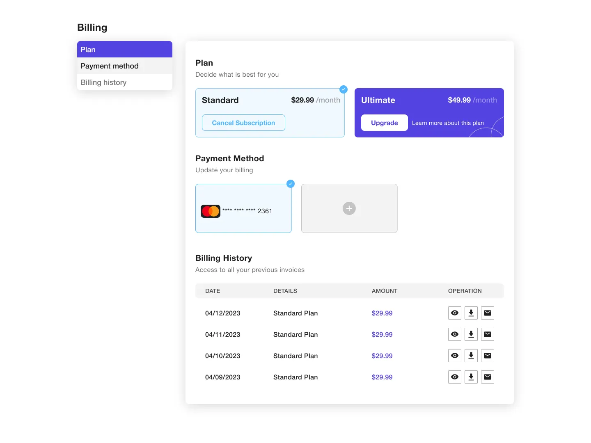

# Challenge Name: Billing Page

You can work on this challenge directly in [BigDevSoon Code Editor](https://app.bigdevsoon.me/challenges/billing-page/browser).

## Introduction

This is an opportunity to apply your skills in HTML, CSS, and JavaScript to create a solution that reflects the design. We encourage creativity and uniqueness while adhering to the design principles outlined in the challenge.

## User Story

As a subscriber, I want to manage my billing details, including my subscription plan, payment method, and billing history, so that I can easily update my information and track my payments.

## Acceptance Criteria

- Display the current subscription plan with options to cancel or upgrade.
- Allow users to update or add a new payment method, showing the current card details partially obscured for security.
- Show a detailed billing history with dates, plan details, amounts, and options to view, download, or email invoices.
- Ensure the billing section is accessible via a side navigation menu with clear labels for each section (Plan, Payment Method, Billing History).

## Get Started

Begin your development with the `index.html` provided in the challenge's folder. You can work on this challenge directly in the [BigDevSoon Code Editor](https://app.bigdevsoon.me/challenges/billing-page/browser) and use the assets available to you and refer to the design screenshot for visual guidelines. Push your boundaries and remember, perfection comes through practice and iteration.

## Best Practices and Tips

- Design Accuracy: Your solution should closely match the layout and style of the provided screenshot.
- Interactivity: Enhance user interaction through JavaScript to elevate the experience beyond a static display.
- Functionality: Ensure that all elements are functional, with attention to detail in the implementation.
- Quality Assurance: Submit a well-coded, clean, and organized solution that adheres to modern web standards.
- Code Quality: Write clean, readable, and well-commented code to maintain best practices in development.
- Responsive Design: Ensure your challenge solution is responsive and functions well on various devices.
- Performance Optimization: Optimize image sizes and script efficiency to improve the loading times and responsiveness of your code.
