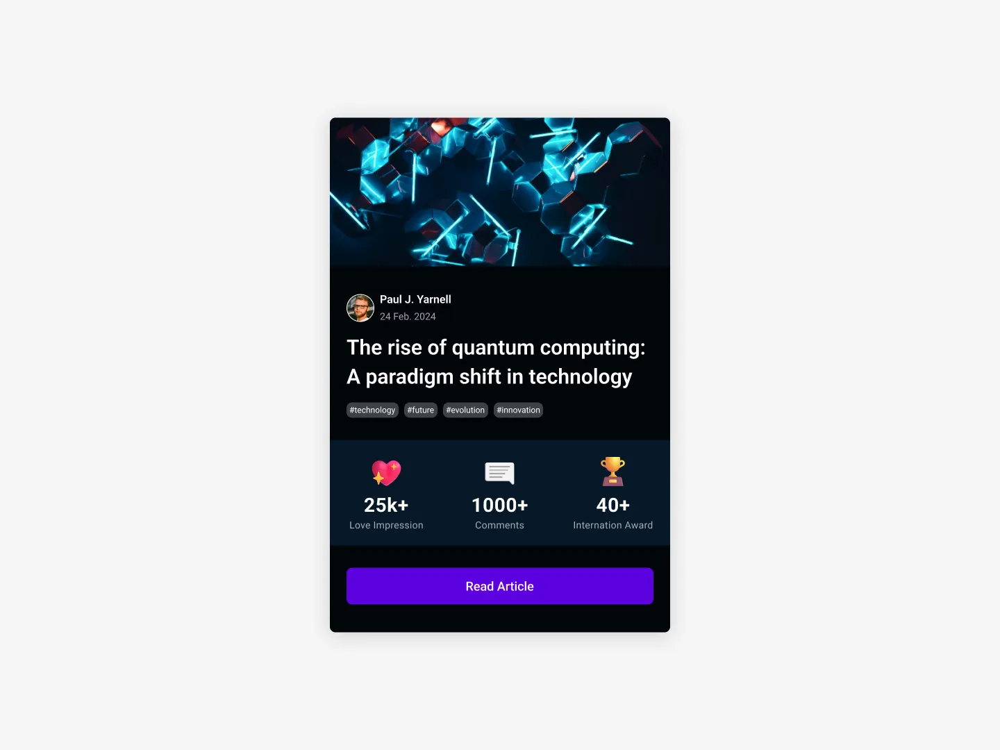

# Challenge Name: Article Summary

You can work on this challenge directly in [BigDevSoon Code Editor](https://app.bigdevsoon.me/challenges/article-summary/browser).

## Introduction

This is an opportunity to apply your skills in HTML, CSS, and JavaScript to create a solution that reflects the design. We encourage creativity and uniqueness while adhering to the design principles outlined in the challenge.

## User Story

As a reader, I want to view key metrics and information about an article, so that I can decide whether it's worth reading based on its popularity and relevance.

## Acceptance Criteria

- Display the article's title, author, and publication date clearly at the top of the card.
- Include tags related to the article's content for quick identification of topics.
- Show key metrics such as the number of impressions, comments, and awards the article has received.
- Provide a prominent "Read Article" button for easy access to the full content.
  Ensure the design is responsive and visually appealing on both mobile and desktop devices.

## Get Started

Begin your development with the `index.html` provided in the challenge's folder. You can work on this challenge directly in the [BigDevSoon Code Editor](https://app.bigdevsoon.me/challenges/article-summary/browser) and use the assets available to you and refer to the design screenshot for visual guidelines. Push your boundaries and remember, perfection comes through practice and iteration.

## Best Practices and Tips

- Design Accuracy: Your solution should closely match the layout and style of the provided screenshot.
- Interactivity: Enhance user interaction through JavaScript to elevate the experience beyond a static display.
- Functionality: Ensure that all elements are functional, with attention to detail in the implementation.
- Quality Assurance: Submit a well-coded, clean, and organized solution that adheres to modern web standards.
- Code Quality: Write clean, readable, and well-commented code to maintain best practices in development.
- Responsive Design: Ensure your challenge solution is responsive and functions well on various devices.
- Performance Optimization: Optimize image sizes and script efficiency to improve the loading times and responsiveness of your code.
