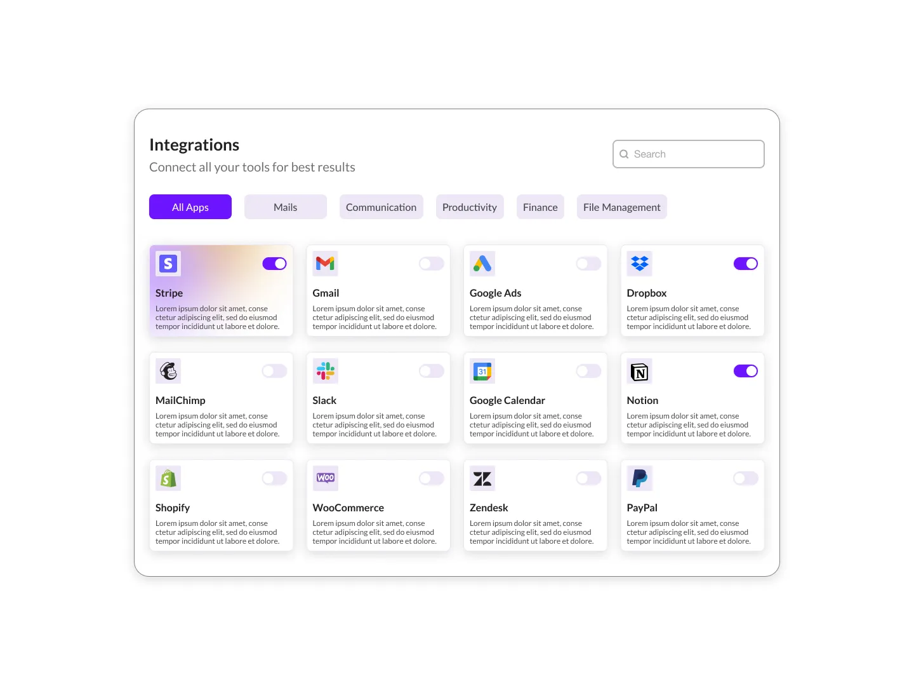

# Challenge Name: App Integrations

You can work on this challenge directly in [BigDevSoon Code Editor](https://app.bigdevsoon.me/challenges/app-integrations/browser).

## Introduction

This is an opportunity to apply your skills in HTML, CSS, and JavaScript to create a solution that reflects the design. We encourage creativity and uniqueness while adhering to the design principles outlined in the challenge.

## User Story

As a user, I want to manage my app integrations from a centralized dashboard, so that I can easily connect or disconnect services as needed.

## Acceptance Criteria

- Display a grid of available integrations with toggle switches to enable or disable each service.
- Categorize integrations by type, such as Mails, Communication, Productivity, Finance, and File Management, with an option to view all apps.
- Provide a search bar to quickly find specific integrations.
- Ensure each integration card includes the app icon, name, and a brief description.
- Highlight the currently active integrations with a visible indicator (e.g., colored toggle switch).
- The interface should be responsive and user-friendly on both desktop and mobile devices.

## Get Started

Begin your development with the `index.html` provided in the challenge's folder. You can work on this challenge directly in the [BigDevSoon Code Editor](https://app.bigdevsoon.me/challenges/app-integrations/browser) and use the assets available to you and refer to the design screenshot for visual guidelines. Push your boundaries and remember, perfection comes through practice and iteration.

## Best Practices and Tips

- Design Accuracy: Your solution should closely match the layout and style of the provided screenshot.
- Interactivity: Enhance user interaction through JavaScript to elevate the experience beyond a static display.
- Functionality: Ensure that all elements are functional, with attention to detail in the implementation.
- Quality Assurance: Submit a well-coded, clean, and organized solution that adheres to modern web standards.
- Code Quality: Write clean, readable, and well-commented code to maintain best practices in development.
- Responsive Design: Ensure your challenge solution is responsive and functions well on various devices.
- Performance Optimization: Optimize image sizes and script efficiency to improve the loading times and responsiveness of your code.
