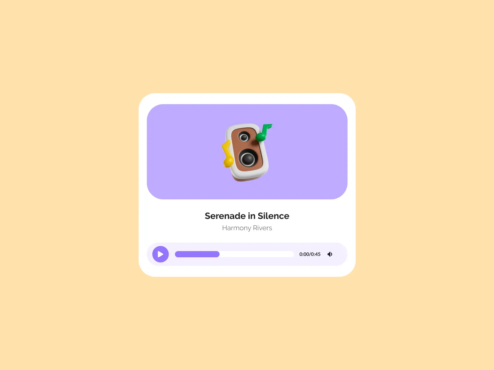

# Challenge Name: Audio Player

You can work on this challenge directly in [BigDevSoon Code Editor](https://app.bigdevsoon.me/challenges/audio-player/browser).

## Introduction

This is an opportunity to apply your skills in HTML, CSS, and JavaScript to create a solution that reflects the design. We encourage creativity and uniqueness while adhering to the design principles outlined in the challenge.

## User Story

As a user, I want to play and control audio tracks directly from a visually appealing player, so that I can easily listen to music or other audio content.

## Acceptance Criteria

- Display the current track name and artist below the track's visual representation.
- Include basic playback controls, such as play/pause and a progress bar.
- Show the track's total duration and the current playback time.
- Provide a volume control option within the player.
- Ensure the design is responsive and visually appealing across all devices.

## Get Started

Begin your development with the `index.html` provided in the challenge's folder. You can work on this challenge directly in the [BigDevSoon Code Editor](https://app.bigdevsoon.me/challenges/audio-player/browser) and use the assets available to you and refer to the design screenshot for visual guidelines. Push your boundaries and remember, perfection comes through practice and iteration.

## Best Practices and Tips

- Design Accuracy: Your solution should closely match the layout and style of the provided screenshot.
- Interactivity: Enhance user interaction through JavaScript to elevate the experience beyond a static display.
- Functionality: Ensure that all elements are functional, with attention to detail in the implementation.
- Quality Assurance: Submit a well-coded, clean, and organized solution that adheres to modern web standards.
- Code Quality: Write clean, readable, and well-commented code to maintain best practices in development.
- Responsive Design: Ensure your challenge solution is responsive and functions well on various devices.
- Performance Optimization: Optimize image sizes and script efficiency to improve the loading times and responsiveness of your code.
